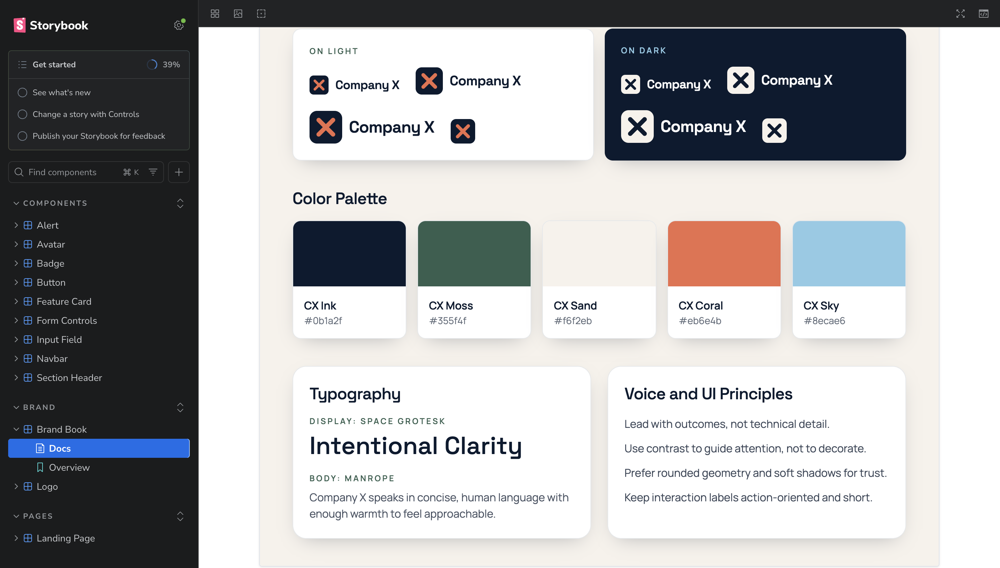

# Company X Storybook

A quick Storybook-driven UI project for a fictional company called Company X. Made with a hanful of prompts using Visual Studio Code and GitHub Copilot using the GPT-5.3-Codex model.

## Stack
- React + TypeScript + Vite
- Tailwind CSS
- Storybook

## Scripts
- `npm run dev` - start the Vite app.
- `npm run build` - type-check and build the app.
- `npm run storybook` - run Storybook locally on port 6006.
- `npm run build-storybook` - create a static Storybook build.

## Getting Started
1. Install dependencies:
   - `npm install`
2. Start Storybook:
   - `npm run storybook`
3. Optional: run the app shell:
   - `npm run dev`
